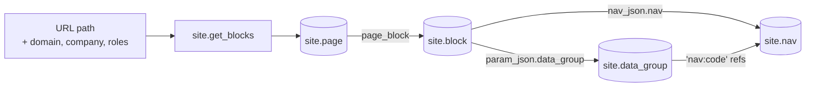

# Data groups and navigation

How the frontend gets everything it renders: **pages are assembled from
blocks, blocks point at data groups and navs, and both of those are pure
JSON in the database.** No screen is hardcoded — a widget is a `data_group`
row, a menu is a `nav` row, and changing either is a data change, not a
deploy.



The chain in one sentence: `site.get_blocks(path, domain, company, roles)`
finds the page for the URL, filters its blocks on visibility, and returns per
page the blocks plus every data group and nav those blocks reference.

## 1. the tables

| table | key | carries |
|---|---|---|
| `site.domain` | `domain_id` | site config per domain (`website_config`, urls, css) |
| `site.page` | `page_id` | url paths (`path`, one per language) and `environment` |
| `site.domain_page` | — | which pages a domain serves |
| `site.block` | `block_id` | one layout block: `block_json` plus visibility filters |
| `site.page_block` | — | which blocks a page shows, in `sort_order` |
| `site.data_group` | `data_group` (name) | one widget definition: `data_group_json` |
| `site.nav` | `nav` (name) | one menu: `nav_json`, plus `company_ids` |

A block's `block_json` is a grid: `cols` → `col` → cells. A cell either
carries content directly or points elsewhere:

```json
{"cols": [{"col": [{"param_json": {"data_group": "widget_showcase"}}]}],
 "block_layout": "one-col"}
```

- `param_json.data_group` — render this data group here;
- `nav_json.nav` — render this nav here.

Visibility is filtered per block: `hidden` (hard off), `roles` (any overlap
with the user's roles), `company_ids` (`[]` = everyone, otherwise only those
companies), `languages`. A page that matches nothing falls through to the
domain's `not_found_page_id`.

## 2. the json mirror in the repo

Database content that is data-not-schema lives mirrored in `json/`, one file
per row, the name column as filename — the same convention as
`json/lookup/<schema>/<lookup>.json`:

| directory | mirrors | filename | file contains |
|---|---|---|---|
| `json/data_group/` | `site.data_group` | the `data_group` name | `{data_group_id, data_group, data_group_json}` |
| `json/nav/` | `site.nav` | the `nav` name | `{nav_id, nav, company_ids, nav_json}` |
| `json/page/` | `site.page` (+ its `page_block` rows) | last segment of the first path | `{page_id, path, environment, domain_ids, blocks}` |
| `json/block/` | `site.block` | `block_<block_id>` | `{block_id, hidden, languages, roles, company_ids, block_json}` |
| `json/lookup/` | `<schema>.lookup` | the `lookup` name | the `lookup_json` itself |

The files are the reviewable source; applying a change to the database goes
through a script, never by editing the database directly.

## 3. data_group_json

One row in `site.data_group` is one widget (or a small family of widgets).
`data_group_json` is **always an array** of widget configs — a list stays a
list, also with one element.

A config, annotated:

```json
{
  "widget_id": "nest_planning_flow_board",
  "src": ["get_nest_planning"],
  "params": [
    {"key": "line_type", "is_query_param": true},
    {"key": "from",      "is_query_param": true}
  ],
  "layout": "flow-board",
  "children": [],
  "field_config": {
    "amount":      {"ui": {"i18n": {"nl": {"title": "Aantal"}, "en": {"title": "Amount"}, "de": {"title": "Menge"}}, "order": 4}, "scale": 0},
    "bucket_name": {"ui": {"i18n": {"nl": {"title": "Bucket"}}, "order": 0}}
  }
}
```

- **`widget_id`** — the widget's identity on the page.
- **`src`** — the database functions that feed it, always an array.
- **`params`** — what the call needs; `{key, is_query_param}` per parameter.
- **`layout`** — which component renders it.
- **`children`** — nested configs, always an array.
- **`field_config`** — *only* fields. Config that belongs to the field grid
  itself lives next to it (`fields_class_name`), never between field names.

The key conventions (the full analysis lives in
`docs/data-group-governance.md`, the layout system in
`docs/data-group-layout.md`):

- **a key has one shape everywhere** — `children`, `hidden_when`, `src` are
  always arrays, also with a single element;
- **`ui.type` says what a value *is*, `ui.control` how it is *shown***;
- **`i18n`** is the multilingual block (never `ml` in new work); `title` is
  the standard text slot — other slots (`subtitle`, `abb`, …) only when they
  are genuinely different texts;
- **`class_name`** is always the element's own css class
  (`ui.class_name` on a field); the grid of the fields is
  `fields_class_name`;
- **`<name>_field` means "the name of a field"**; without the suffix it is
  the value itself;
- **units live in the key**: `duration_in_seconds`, `waste_percentage` —
  never a separate `unit` property, never `_perc`/`_pct`;
- **one condition shape**: `{field, op, value}` — comparing two fields uses
  `value_field`;
- **sorting** is `sort: {field, direction}`; **grouping** is `group_by`
  (always an array of id columns) with `group_title_fields` in the same
  order;
- **drag & drop** follows `docs/contracts/drag-and-drop.md`: a `drop` block
  with `order_field`; `within_fields` ⊆ `group_by`;
- **chart config** keys are `<chart>_chart_config`; variants are properties
  or a prefix (`stacked_bar_chart_config`), never a separate key per variant;
- **`no_*` / `hide_*` booleans default to false**.

### how a data group reaches the page

`site.get_page_data_groups(page_id)` scans the page's blocks for
`param_json.data_group` cells and returns each referenced group as
`"<name>:<block_id>"` with its json — the block id suffix keeps two
placements of the same widget apart. `site.get_data_group(name)` serves a
single group and resolves nav references on the way out (see below).

## 4. nav_json

One row in `site.nav` is one menu. The name is the handle
(`xfw.main-menu-left`, `resource_menu`, …); `nav_json` is an array of menu
nodes; `company_ids` scopes the whole nav to specific companies (`[]` =
everyone).

A node in the **current form** — snake_case, texts in `i18n`:

```json
{
  "i18n": {"nl": {"path": "xfw/nl/planning", "text": "Planning"}},
  "path": "xfw/nl/planning",
  "type": null,
  "func": null,
  "nav_item_id": 230402,
  "access_level": ["superAdmin"],
  "is_search_global": false,
  "menu": [ { "…": "child nodes, same shape" } ]
}
```

- **`i18n`** — per language the `path` and `text` of the entry;
- **`path`** — the route the entry navigates to;
- **`func`** — an action instead of (or besides) a route;
- **`access_level`** — roles that see the entry; `null` = everyone;
- **`is_search_global`** — whether the entry joins the global search;
- **`menu`** — child nodes; a node with `menu` is a group, the shape recurses.

The oldest nav (`xfw.home`) still carries the **legacy form** — camelCase
keys (`isVisible`, `accessLevel`, `noToggle`, `paramsFrom`, `skateBoard`) and
a bare `text` instead of `i18n`. It works, but it is history: new navs and
edits follow the current form above.

### nav references inside data groups

A data group never embeds a menu; it points at one with the string
`"nav:<code>"` anywhere in its json. `site.resolve_nav_refs` walks the whole
document and replaces every such string with the `nav_json` of that code:

```json
{"nav": "nav:resource_menu"}   →   {"nav": {"menu": ["…"]}}
```

One level only — a nav_json is not scanned for further refs — and unknown
codes pass through unchanged. `site.get_data_group` applies this on every
read, so the frontend always receives resolved menus.

### how navs reach the page

| function | serves |
|---|---|
| `site.get_main_menu()` | `xfw.main-menu-left` + `xfw.main-menu-right` |
| `site.get_search_nav()` | `xfw.main-search` |
| `site.get_page_navs(page_id, company_id)` | every nav referenced by the page's blocks (`nav_json.nav` cells) |
| `site.get_data_group(name)` | inline, via the `nav:` refs |

`get_page_navs` personalizes: a nav whose `company_ids` names the user's
company **wins over** the generic (`[]`) nav of the same name — same
most-specific-wins idea as everywhere else in the system.

## 5. filtering summary

| level | filter | rule |
|---|---|---|
| page | `domain_page` | a domain only serves its own pages; no match → the domain's 404 page |
| block | `hidden` | hard off |
| block | `roles` | any overlap with the user's roles (both empty = public) |
| block | `company_ids` | `[]` = everyone, otherwise only listed companies |
| block | `languages` | which languages the block renders in |
| nav | `company_ids` | `[]` = everyone; a company-specific nav beats the generic one |
| nav item | `access_level` | roles that see the entry; `null` = everyone |

Everything above is data. Adding a page, moving a widget, renaming a menu
entry, scoping a block to one customer — all of it is a row change, mirrored
in `json/`, with no code involved.
