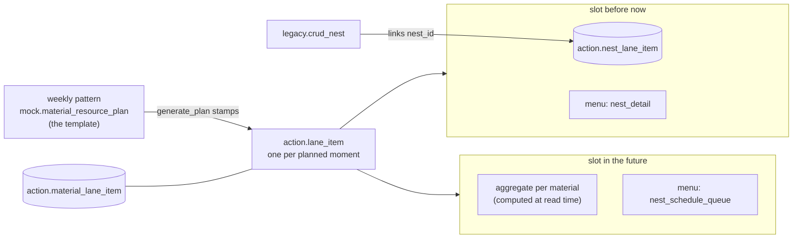

# Nest planning and lane items

Plan for wiring the nest and print agendas: **every planned moment is a real
lane item, future included.** A future lane item is a slot that shows the
aggregated to-be-planned production_orderlines for its material; once
orderlines are pushed to the nester and `legacy.nest` rows exist, the nests
hang on those same lane items and the board shows whether nesting went well.
The client shifts a moment by moving its lane item and adds a moment by
creating a new lane item — **no copy_index anywhere**.



## 1. what is already in place

- **The daily skeleton**: `site.refresh_derived_data` creates the
  material-resource-plan per workday × line type 14 days ahead, with the
  material lanes, `plan_lane` and the material link per lane
  (`mock.generate_plan`).
- **The dual read**: `mock.get_nest_schedule` already splits on hung nests —
  lanes with nests read `action.nest_lane_item`, the rest goes through
  `mapping.get_production_orderline_aggregate`.
- **The menus**: the three complementary nav items exist —
  `nest_schedule_queue` and `production_board_detail` while `nest_count = 0`,
  `nest_detail` (fed by `nest_ids`) once nests exist.
- **The pv2 side**: `action.crud_object` already links nests to its own lane
  items (`source = 'pv2'`) with a delete-insert per set.
- **But the future moments are not lane items yet**: today the weekly
  pattern rows themselves play that role, complete with `copy_index`,
  `start_offset_in_seconds` and `is_pinned` — and `get_nest_schedule` /
  `get_print_schedule_materials` reconstruct the moments from the pattern
  and `lookup_nest_moments` on every read.

## 2. the decisions

1. **Lane items exist for the future too.** `mock.generate_plan` stamps,
   together with each material lane, its lane item(s) out of the weekly
   pattern: `start_offset_in_seconds`, `is_pinned` and `sort_order` from the
   pattern row. The pattern (`mock.material_resource_plan`) stays only as
   the **template**; after stamping, the lane items are the truth the boards
   read and the client mutates. The material of a slot is a link on the
   **item**, not on the lane: a new table **`action.material_lane_item`**
   (`material_id`, `lane_item_id`), the same shape as `nest_lane_item` —
   `generate_plan` stamps it together with the slot, a copied slot takes its
   material along, and `lane_item` itself stays generic (pv2 machine items
   carry no material). The lane-level detour
   `mock.material_resource_plan_lane` disappears once the reads use it.
2. **No copy_index.** An extra moment is a **new lane item** on the same
   lane (nest agenda). In the print agenda, where a lane carries exactly one
   lane item, a copy pushes through to a **new lane + lane item** — the
   lane order on the board comes from the lane item's `sort_order`, as it
   already does today.
3. **The future side stays an aggregate, computed at read time.** A future
   lane item is only the slot; the orderline numbers per material come from
   `get_production_orderline_aggregate` on every read, matched to the slot
   through `material_lane_item.material_id` and the lane date. So
   `action.production_orderline_lane_item` goes — it holds 0 rows and a
   copied orderline list per slot is the wrong idea (facts once).
4. **The nest side keeps one link table: `action.nest_lane_item`.** Slots
   before now carry the nests that were actually made.
5. **A lane without `lane_date` is invalid.** The live table holds 701 of
   them (of 1101); the column is even nullable in the database while the
   repo DDL says `not null`. Clean up and align.
6. **The reads simplify.** With real slots in `action.lane_item`,
   `get_nest_schedule` and especially `get_print_schedule_materials` stop
   reconstructing moments from the pattern + `lookup_nest_moments` per read
   and simply select the lane items of the plan.

## 3. the link from legacy.crud_nest

Everything needed lives on the nest itself: `nest_json` carries
`material_id`, `nest_date` and `production_line_id`.

Resolution per created/merged nest, set-based over the payload:

1. **slot candidates** — the slots of the day for the nest's material:
   `action.plan` (`type = 'material-resource-plan'`,
   `plan_date = nest_date::date`, newest per line type) → `plan_lane` →
   `lane` → `lane_item` → `material_lane_item.material_id` = nest material.
2. **lane item** — the slot on that lane whose window covers the nest
   moment (`start_offset_in_seconds ≤ seconds(nest_date) <
   start + duration`, `level = 0`); several matches → the latest start
   wins. **No match → create one**: `source = 'nest'`,
   `source_ref = nest_id`, offset from the nest moment — the pv2
   find-or-create shape, `ON CONFLICT (source, source_ref)` keeps it
   idempotent.
3. **link** — delete-insert `action.nest_lane_item (nest_id, lane_item_id,
   sort_order)` per nest in the payload, so a re-sent nest moves along
   cleanly. A deleted or cancelled nest drops its links in the same block.

No lane found (beyond the 14-day horizon, or a line type without a plan):
skip the link, never invent a lane; the backfill catches it once the plan
exists.

## 4. the phases

**Phase 1 — clean up** (one script)

```sql
-- links and items of dateless lanes go with them
DELETE FROM action.nest_lane_item nli
USING action.lane_item li JOIN action.lane l ON l.lane_id = li.lane_id
WHERE nli.lane_item_id = li.lane_item_id AND l.lane_date IS NULL;

DELETE FROM action.lane_item li
USING action.lane l
WHERE li.lane_id = l.lane_id AND l.lane_date IS NULL;

DELETE FROM action.lane WHERE lane_date IS NULL;   -- plan_lane cascades

ALTER TABLE action.lane ALTER COLUMN lane_date SET NOT NULL;

DROP TABLE action.production_orderline_lane_item;
```

(Plus `git rm sql/action/production_orderline_lane_item.sql`.)

**Phase 2 — slots for the future** — `mock.generate_plan` also creates the
lane items per material lane from the pattern row (`start_offset`,
`is_pinned`, `sort_order`; `source = 'material-plan'`,
`source_ref = material_resource_plan_id || ':' || plan_date` for
idempotency), **plus the material link per slot in the new
`action.material_lane_item`**. One backfill pass stamps slots onto the
already-created plans of the coming 14 days.

**Phase 3 — client mutations without copy_index** — moving a moment =
update of `start_offset_in_seconds`/`sort_order` on the lane item; an extra
moment = insert of a new lane item (nest agenda: same lane; print agenda:
new lane + lane item, hung in `plan_lane`). One crud on lane_item level
replaces the pattern mutations of `mock.crud_material_resource_plan` for
day-to-day planning; the pattern itself is only edited to change the
template.

**Phase 4 — crud_nest links** — the resolution of §3 as one set-based
block after the nest upsert, same transaction.

**Phase 5 — the reads** — `get_nest_schedule` and
`get_print_schedule_materials` select the slots from `action.lane_item`
(with the aggregate for future slots, nests via `nest_lane_item` for past
slots) instead of deriving moments from the pattern, with the aggregate matched
per slot through `material_lane_item`; `copy_index` disappears from their
outputs and from the data group configs (`copy_index_field`), and
`mock.material_resource_plan_lane` is dropped once nothing reads it.

**Phase 6 — backfill nests** — run the §3 resolution over the recent
`legacy.nest` rows so the boards of the past weeks show their nests.

## 5. open points

- **Duration of a slot**: 0 seconds (a marker) or a default block? Affects
  only how the timeline draws it.
- **Several slots per material per day**: the aggregate is per material and
  day; with extra moments the numbers would repeat per slot. Decide whether
  the aggregate splits by moment window (orderlines before slot N, between
  N and N+1, …) or shows on the first open slot only.
- **The drag & drop contract**: the data groups still declare
  `copy_index_field`; dropping copy_index means the drop block moves to
  "new lane item" semantics — one contract change in
  `docs/contracts/drag-and-drop.md`, applied to the schedule data groups.
- **`mock.` promotion**: pattern, lane link and slots now sit on a
  production write path — domain-model.md open point 10 (promote
  `mock.material_resource_plan*` out of `mock.`) should ride along with
  phase 2 or directly after.
