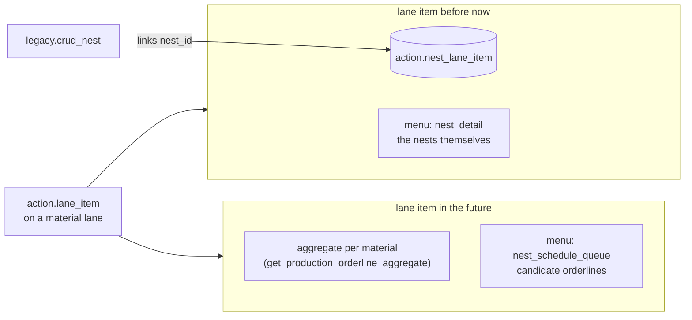

# Nest planning and lane items

Plan for wiring the nest agenda: **the future is an aggregate, the past is
nests.** A material lane item shows the aggregated to-be-planned
production_orderlines for its material and day; once orderlines are pushed to
the nester and `legacy.nest` rows exist, those nests hang on the lane items
and the board shows whether nesting went well.



## 1. what is already in place

- **The daily skeleton**: `site.refresh_derived_data` creates the
  material-resource-plan per workday × line type 14 days ahead, with the
  material lanes, `plan_lane` and the material link per lane
  (`mock.generate_plan`).
- **The dual read**: `mock.get_nest_schedule` already works exactly along
  the intended split — its `lane_nest` CTE collects the nests hung on a
  lane's items via `action.nest_lane_item`, and only the lanes *without*
  nests go through `mapping.get_production_orderline_aggregate`. Checked:
  the aggregate/future side needs **no lane items at all**; lane items are
  only the bridge from lane to nest.
- **The menus**: the three complementary nav items exist —
  `nest_schedule_queue` and `production_board_detail` show while
  `nest_count = 0`, `nest_detail` (fed by `nest_ids`) once nests exist.
- **The pv2 side**: `action.crud_object` already links nests to its own
  lane items (`source = 'pv2'`) with a delete-insert per set.

## 2. the decisions

1. **One link table on the nest side: `action.nest_lane_item`.**
   `action.production_orderline_lane_item` goes — it holds 0 rows and it is
   the wrong idea: the future side is an *aggregate per material*, computed
   at read time from the orderline facts, never a copied list of orderlines
   per lane item. Same facts-once principle as everywhere else. The queue
   (`nest_schedule_queue`) is an independent read of the same facts.
2. **A lane without `lane_date` is invalid.** The live table holds 701 of
   them (of 1101); the column is even nullable in the database while the
   repo DDL already says `not null`. Clean up and align.
3. **`legacy.crud_nest` links every nest it creates or merges** to a lane
   item on the material lane of its day — creating the lane item first when
   none exists.

## 3. the link from legacy.crud_nest

Everything needed lives on the nest itself: `nest_json` carries
`material_id`, `nest_date` and `production_line_id`.

Resolution per created/merged nest, set-based over the payload:

1. **lane** — the material lane of the day:
   `action.plan` (`type = 'material-resource-plan'`,
   `plan_date = nest_date::date`, newest per line type) → `plan_lane` →
   `lane` → `mock.material_resource_plan_lane` →
   `mock.material_resource_plan.material_id = nest material_id`.
2. **lane item** — the planned slot on that lane whose time window covers
   the nest moment (`start_offset_in_seconds ≤ seconds(nest_date) <
   start + duration`, `level = 0`); when several match, the latest start
   wins. **No match → create one**: `source = 'nest'`,
   `source_ref = nest_id`, `start_offset_in_seconds` from the nest moment,
   `duration_in_seconds = 0`, `no_split = true` — the same
   find-or-create shape as the pv2 items, so `ON CONFLICT (source,
   source_ref)` keeps it idempotent.
3. **link** — delete-insert `action.nest_lane_item (nest_id, lane_item_id,
   sort_order)` per nest in the payload, so a re-sent nest moves along
   cleanly (the pv2 pattern in `crud_object`).

No lane found (no plan yet for that day — beyond the 14-day horizon, or a
line type without a plan): skip the link, never invent a lane. The nest
stays visible through the queue; the link appears as soon as the plan
exists and the nest is sent again — and the backfill (phase 4) catches the
rest.

## 4. the phases

**Phase 1 — clean up** (one script)

```sql
-- links and items of dateless lanes go with them
DELETE FROM action.nest_lane_item nli
USING action.lane_item li JOIN action.lane l ON l.lane_id = li.lane_id
WHERE nli.lane_item_id = li.lane_item_id AND l.lane_date IS NULL;

DELETE FROM action.lane_item li
USING action.lane l
WHERE li.lane_id = l.lane_id AND l.lane_date IS NULL;

DELETE FROM action.lane WHERE lane_date IS NULL;   -- plan_lane cascades

ALTER TABLE action.lane ALTER COLUMN lane_date SET NOT NULL;

DROP TABLE action.production_orderline_lane_item;
```

(Plus `git rm sql/action/production_orderline_lane_item.sql`.)

**Phase 2 — crud_nest links** — extend `legacy.crud_nest` with the
resolution of §3 as one set-based block after the nest upsert, inside the
same transaction. A nest that is deleted or cancelled drops its
`nest_lane_item` rows in the same block.

**Phase 3 — the board** — nothing new to build: `get_nest_schedule`
already splits on hung nests, and the menu items already switch on
`nest_count`. Verify only that `nest_ids`/`nest_count` per lane row come
from `nest_lane_item` for lanes in the past.

**Phase 4 — backfill** — one script that runs the §3 resolution over the
existing `legacy.nest` rows of the last weeks, so the boards of recent days
show their nests immediately.

## 5. open points

- **Duration of a created lane item**: 0 seconds (a marker) or a default
  block? Affects only how the timeline draws it.
- **Cancelled nests**: `crud_nest` sees a cancel as a status in
  `nest_json`; decide whether that also removes the link or the board
  greys it out (the board already filters cancelled nests in its joins).
- **`mock.` promotion**: the lane resolution walks
  `mock.material_resource_plan_lane`; domain-model.md open point 10 —
  promote the material plan tables out of `mock.` — becomes more urgent now
  that a production write path (`crud_nest`) depends on them.
