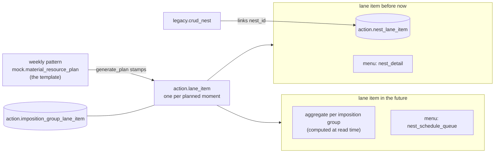

# Nest planning and lane items

Plan for wiring the nest and print agendas: **every planned moment is a real
lane item, future included.** A future lane item shows the aggregated
to-be-planned production_orderlines for its imposition group; once
orderlines are pushed to the nester and `legacy.nest` rows exist, the nests
hang on those same lane items and the board shows whether nesting went well.
The client shifts a moment by moving its lane item and adds a moment by
creating a new lane item — **no copy_index anywhere**.

## 1. the one link that carries it all

**`action.imposition_group_lane_item`** (`imposition_group_id`,
`lane_item_id`) says what a planned moment produces. It is the only identity
link on the future side, and the nest side finds its lane items through it.

**The transition:** `imposition_group_id` acts as an **alias of
`material_id`** for now — `catalog.imposition_group` was seeded 1:1 from the
material ids, so `material_id = imposition_group_id` is a valid join, and
every place that joins this way carries a `--` comment saying so. Later the
groups become real imposition groups (the item-code-path combinations from
the xbom, `catalog.get_imposition_group`); the join comments mark exactly
the places that then switch from material to group resolution. Nothing else
changes shape.

## 2. the decisions

1. **Lane items exist for the future too.** `mock.generate_plan` stamps,
   together with each material lane, its lane item(s) out of the weekly
   pattern: `start_offset_in_seconds`, `is_pinned` and `sort_order` from the
   pattern row, plus the group link in `imposition_group_lane_item`. The
   pattern (`mock.material_resource_plan`) stays only as the **template**;
   after stamping, the lane items are the truth the boards read and the
   client mutates. A copied lane item takes its group link along;
   `lane_item` itself stays generic (pv2 machine items carry no group).
   The lane-level detour `mock.material_resource_plan_lane` disappears once
   the reads use the group link.
2. **No copy_index.** An extra moment is a **new lane item** on the same
   lane (nest agenda). In the print agenda, where a lane carries exactly one
   lane item, a copy pushes through to a **new lane + lane item** — the
   lane order on the board comes from the lane item's `sort_order`.
3. **The future side stays an aggregate, computed at read time.** A future
   lane item is only the planned moment; the orderline numbers come from
   `get_production_orderline_aggregate` on every read, matched to the lane
   item through `imposition_group_lane_item.imposition_group_id` and the
   lane date. Durations are read-time too: the future from the aggregate
   and the material sizes in `line_json.specs` of
   `material_production_line`, the nests from `width × height ×
   sum(amount)`. Nothing derived is stored.
4. **The nest side keeps one link table: `action.nest_lane_item`.** Lane
   items before now carry the nests that were actually made.
5. **A lane without `lane_date` is invalid** — cleaned up (was 701 of 1101,
   nothing hung on them) and `lane_date` is `not null` since.
6. **The reads simplify.** With real lane items, `get_nest_schedule` and
   especially `get_print_schedule_materials` stop reconstructing moments
   from the pattern + `lookup_nest_moments` per read and simply select the
   lane items of the plan.

## 3. the link from legacy.crud_nest

Everything needed lives on the nest itself: `nest_json` carries
`material_id`, `nest_date` and `production_line_id`.

Resolution per created/merged nest, set-based over the payload:

1. **plan** — the material-resource-plan of the nest day
   (`plan_date = nest_date::date`, newest per line type; line type through
   `relation.production_line`).
2. **lane** — the lane of the nest material on that plan, found through the
   group link of its lane items:
   `plan_lane` → `lane` → `lane_item` →
   `imposition_group_lane_item.imposition_group_id = nest material_id` —
   **the alias join**, commented as such; when real groups arrive the nest
   resolves its group from the xbom here instead.
3. **lane item** — the latest one on that lane starting at or before the
   nest moment (the stamped items are 0-duration moments, so a
   covering-window match would never hit), else the first of the day. Lane
   without any item → create one (`source = 'nest'`,
   `source_ref = nest_id`, idempotent on the source key).
4. **link** — delete-insert `action.nest_lane_item (nest_id, lane_item_id,
   sort_order)` per nest in the payload; only links whose lane item has
   `source in ('material-plan', 'nest')` are replaced — the pv2 machine
   links belong to `action.crud_object`. Cancelled nests only lose their
   link; no plan or lane for the day means no link, never an invented lane.

## 4. the phases

| phase | what | status |
|---|---|---|
| 1 | clean up: dateless lanes out, `lane_date not null`, `production_orderline_lane_item` dropped | in `sql/migration_lane_slots.sql` |
| 2 | lane items for the future: `generate_plan` stamps item + group link from the pattern; backfill onto the existing plans | same script + `sql/mock/generate_plan.sql` |
| 3 | client mutations without copy_index: move = update offset/sort_order, extra moment = new lane item (+ lane in the print agenda); one crud on lane_item level replaces the day-to-day pattern mutations | open |
| 4 | `legacy.crud_nest` links every nest to its lane item (§3) | in `sql/legacy/crud_nest.sql` |
| 5 | the reads: `get_nest_schedule` / `get_print_schedule_materials` select the lane items (aggregate ahead through the group link, nests behind through `nest_lane_item`); `mock.material_resource_plan_lane` is dropped once nothing reads it | open |
| 6 | backfill the recent nests onto their lane items | in `sql/migration_backfill_nest_links.sql` |
| 7 | real imposition groups: stamping and nest resolution switch from the material alias to `catalog.get_imposition_group` (the xbom paths); the alias comments mark every switch point | later |

## 5. open points

- **Several lane items per group per day**: the aggregate is per group and
  day; with extra moments the numbers would repeat per lane item. Decide
  whether the aggregate splits by moment window (orderlines before moment N,
  between N and N+1, …) or shows on the first open moment only.
- **The drag & drop contract**: `copy_index_field` is already out of the
  contract; the client-side copy gesture must create the new lane item
  through the phase-3 crud.
- **`mock.` promotion**: the pattern and its plan tables sit on a production
  write path now — domain-model.md open point 10 (promote
  `mock.material_resource_plan*` out of `mock.`) rides along with phase 5.
