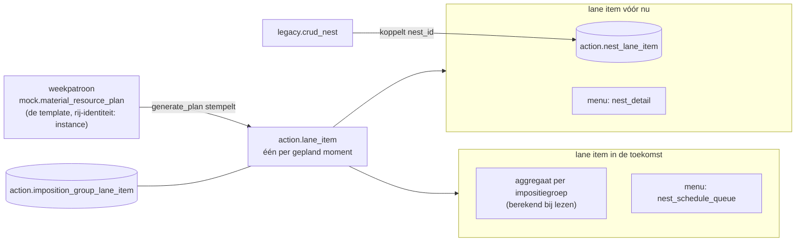

# Nestplanning en lane items

Plan voor de nest- en printagenda's: **elk gepland moment is een echt lane
item, ook in de toekomst.** Een toekomstig lane item toont de geaggregeerde
te-plannen production_orderlines van zijn impositiegroep; zodra orderlines
naar de nester zijn geduwd en er `legacy.nest`-rijen bestaan, hangen de
nests aan diezelfde lane items en laat het bord zien of het nesten goed
ging. De client verschuift een moment door zijn lane item te verplaatsen en
voegt een moment toe met een nieuw lane item; **elke mutatie schrijft door
naar de template**, zodat opnieuw stempelen altijd de actuele planning
oplevert.

## 1. de ene link die alles draagt

**`action.imposition_group_lane_item`** (`imposition_group_id`,
`lane_item_id`) zegt wat een gepland moment produceert. Het is de enige
identiteitslink aan de toekomstkant, en de nestkant vindt zijn lane items
erdoorheen.

**De overgang:** `imposition_group_id` is voorlopig een **alias van
`material_id`** — `catalog.imposition_group` is 1:1 uit de material-id's
geseed, dus `material_id = imposition_group_id` is een geldige join, en elke
plek die zo joint draagt een `--`-comment die dat zegt. Later worden de
groepen echte impositiegroepen (de item-code-path-combinaties uit de xbom,
`catalog.get_imposition_group`); de join-comments markeren precies de
plekken die dan omschakelen van material- naar groep-resolutie. Verder
verandert er niets van vorm.

## 2. de beslissingen

1. **Lane items bestaan ook voor de toekomst.** `mock.generate_plan`
   stempelt bij elke material-lane zijn lane item(s) uit het weekpatroon:
   `start_offset_in_seconds`, `is_pinned` en `sort_order` uit de
   patroonrij, plus de groeplink in `imposition_group_lane_item`. Elk
   gestempeld lane item onthoudt **uit welke template-rij het komt** (de
   patroonlink, inclusief `instance`). Na het stempelen zijn de lane items
   de waarheid die de borden lezen en de client muteert;
   `lane_item` zelf blijft generiek (pv2-machine-items dragen geen groep).
   De lane-omweg `mock.material_resource_plan_lane` verdwijnt zodra de
   reads de groeplink gebruiken.
2. **`instance` in plaats van copy_index — met write-through.** De
   template `mock.material_resource_plan` krijgt `instance` (volgnummer
   van het herhaalde moment, uniek binnen de lane: `weekday` + `step` +
   `resource_uid` + `material_id`; default 0). Clientmutaties gaan altijd
   naar **beide kanten**, in één call van de fase-3 crud:
   - **kopie** = nieuw lane item (in de printagenda: nieuwe lane + lane
     item) **én** een nieuwe template-rij met het volgende `instance`;
   - **verplaatsen of `sort_order` wijzigen** = het lane item **én** zijn
     template-rij bijwerken.
   `instance` blijft server-side; de client ziet alleen lane items, de
   lane-volgorde op het bord komt uit `sort_order` van het lane item.
3. **Ketening via `resource_json` — `next_start_offset_in_seconds`
   vervalt.** In `nest_schedule` volgt de start van de volgende
   material-lane niet meer uit een opgeslagen offset, maar uit de vorige
   lane zelf, precies zoals een volgende step (print → cut) al ketent in
   `plan_timeline`:
   - de read levert per lane item **twee duraties**, allebei rekentijd
     (niets opgeslagen): `first_item_duration` (eerste nest klaar) en
     `batch_duration` (hele batch klaar, = `duration_in_seconds`);
   - de resource van de lane (`resource_uid` op de template-rij) zegt in
     `resource_json.next_trigger_type` welke daarvan de volgende start
     bepaalt: `first_item_duration`, `batch_duration`, of `after_lag` —
     bij `after_lag` is de offset `resource_json.fixed_lag_duration`
     (de bestaande lag-key);
   - **de frontend ketent zelf**, met hetzelfde connector-mechanisme als
     `plan_timeline` (`from_anchor_offset_field: "next_trigger_type"`) —
     geen nieuw frontend-concept, geen server-side startberekening. In de
     data_groups `nest_schedule` en `print_schedule` vervangt het
     connector-blok de key `next_start_offset_in_seconds_field`; daarna
     kan de kolom uit `mock.material_resource_plan` en uit de reads.
4. **De toekomstkant blijft een aggregaat, berekend bij lezen.** Een
   toekomstig lane item is alleen het geplande moment; de orderline-cijfers
   komen bij elke read uit `get_production_orderline_aggregate`, gematcht
   via `imposition_group_lane_item.imposition_group_id` en de lane-datum.
   Duraties zijn ook rekentijd: de toekomst uit het aggregaat en de
   material-maten in `line_json.specs` van `material_production_line`, de
   nests uit `width × height × sum(amount)`. Niets afgeleids wordt
   opgeslagen.
5. **De nestkant houdt één linktabel: `action.nest_lane_item`.** Lane items
   vóór nu dragen de nests die echt gemaakt zijn.
6. **Een lane zonder `lane_date` is ongeldig** — opgeruimd (701 van 1101,
   er hing niets aan) en `lane_date` is sindsdien `not null`.
7. **De reads worden simpeler.** Met echte lane items stoppen
   `get_nest_schedule` en vooral `get_print_schedule_materials` met per
   read momenten reconstrueren uit patroon + `lookup_nest_moments`; ze
   selecteren gewoon de lane items van het plan.

## 3. de link vanuit legacy.crud_nest

Alles wat nodig is staat op de nest zelf: `nest_json` draagt `material_id`,
`nest_date` en `production_line_id`.

Resolutie per aangemaakte/samengevoegde nest, set-based over de payload:

1. **plan** — het material-resource-plan van de nestdag
   (`plan_date = nest_date::date`, nieuwste per line type; line type via
   `relation.production_line`).
2. **lane** — de lane van het nest-material op dat plan, gevonden via de
   groeplink van zijn lane items:
   `plan_lane` → `lane` → `lane_item` →
   `imposition_group_lane_item.imposition_group_id = nest material_id` —
   **de alias-join**, als zodanig gecommentarieerd; komen de echte groepen,
   dan resolvet de nest hier zijn groep uit de xbom.
3. **lane item** — het laatste op die lane dat start op of vóór het
   nestmoment (de gestempelde items zijn 0-duratie-momenten, dus een
   covering-window-match raakt nooit), anders het eerste van de dag. Lane
   zonder item → er één aanmaken (`source = 'nest'`,
   `source_ref = nest_id`, idempotent op de source-key).
4. **link** — delete-insert `action.nest_lane_item (nest_id, lane_item_id,
   sort_order)` per nest in de payload; alleen links waarvan het lane item
   `source in ('material-plan', 'nest')` heeft worden vervangen — de
   pv2-machinelinks horen bij `action.crud_object`. Geannuleerde nests
   verliezen alleen hun link; geen plan of lane die dag betekent geen link,
   nooit een verzonnen lane.

## 4. de fasen

| fase | wat | status |
|---|---|---|
| 1 | opruimen: dateloze lanes eruit, `lane_date not null`, `production_orderline_lane_item` gedropt | in `sql/migration_lane_slots.sql` |
| 2 | lane items voor de toekomst: `generate_plan` stempelt item + groeplink uit het patroon (patroonlink incl. `instance`); backfill op de bestaande plannen; `instance` op `mock.material_resource_plan` | zelfde script + `sql/mock/generate_plan.sql` |
| 3 | clientmutaties met write-through: move/sort = lane item **én** template-rij bijwerken, kopie = nieuw lane item (+ lane in de printagenda) **én** nieuwe template-rij met volgend `instance`; één crud op lane_item-niveau vervangt de dag-tot-dag patroonmutaties | in `sql/action/crud_lane_item.sql` |
| 4 | `legacy.crud_nest` koppelt elke nest aan zijn lane item (§3) | in `sql/legacy/crud_nest.sql` |
| 5 | de reads: één rij per lane item — de muteerbare waarheid (offset, pin, sort) uit `action.lane_item`, nests per item via `nest_lane_item`, `lane_item_id`/`lane_id` in de output als mutatiedoel; plus `first_item_duration`, `batch_duration`, `next_trigger_type` en `fixed_lag_duration` voor de ketening (§2.3); de identiteit blijft uit de patroonlink komen zolang die de template is | in `sql/mock/get_print_schedule_materials.sql` + `get_nest_schedule.sql` |
| 6 | data_groups `nest_schedule`/`print_schedule` op het connector-mechanisme; daarna kolom `next_start_offset_in_seconds` uit `mock.material_resource_plan` en de reads | volgt op 5 |
| 7 | backfill van de recente nests op hun lane items | in `sql/migration_backfill_nest_links.sql` |
| 8 | echte impositiegroepen: stempelen en nestresolutie schakelen van de material-alias naar `catalog.get_imposition_group` (de xbom-paden); de alias-comments markeren elk omschakelpunt | later |

## 5. besloten

- **Meerdere lane items per groep per dag** tonen **dezelfde
  aggregaatcijfers** — geen splitsing per momentvenster. Het duplicaat is
  een planningsmoment, geen verdeling van het werk.
- **Het drag & drop-contract verandert niet**: geen `copy_index_field`
  richting de client — `instance` is puur server-side, het kopieergebaar
  maakt via de fase-3 crud een nieuw lane item én een nieuwe template-rij.
- **`mock.material_resource_plan` blijft waar hij staat** en is voorlopig
  *de* template voor het stempelen van lane items; een ander
  template-mechanisme vervangt hem later. Geen promotie uit `mock.` als
  onderdeel van dit plan.
