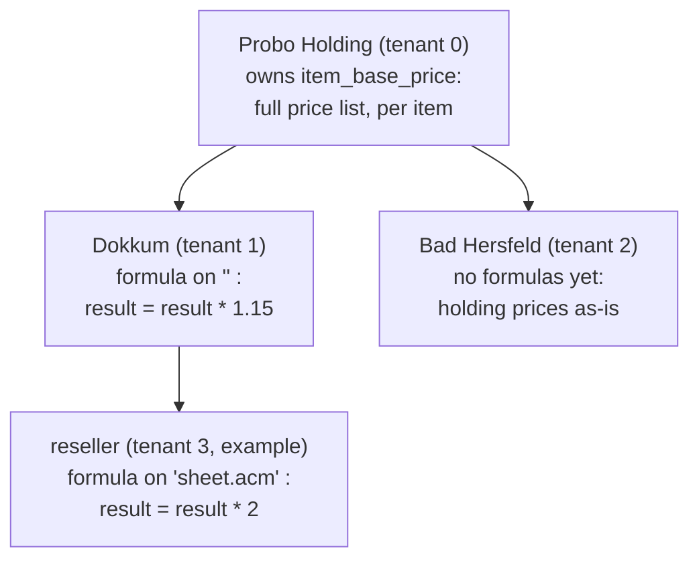

# The pricing chain

How item prices work across tenants: **prices exist once, everything else is
a formula.** The root tenant (Probo Holding) owns the full price list. Every
other tenant stores only a rule relative to its parent — "our price is the
parent's price × 1.15". Reading a price walks the chain from the root down and
applies the rules in order. Nothing is copied, nothing is cached, so a price
change at the root touches zero rows anywhere else.



Three tables and one function carry the whole thing.

## 1. the tenant tree — `site.tenant`

A tenant without `parent_tenant_id` is a root. Every other tenant prices
against its parent, always exactly one level up.

```sql
create table site.tenant
(
	tenant_id integer generated by default as identity
		primary key,
	parent_tenant_id integer
		references site.tenant (tenant_id),
	name text not null,
	abb text not null,
	production_company_id integer,
	created_at timestamp with time zone default now() not null
);
```

| tenant_id | parent_tenant_id | name |
|---|---|---|
| 0 | *null* | Probo Holding |
| 1 | 0 | Dokkum |
| 2 | 0 | Bad Hersfeld |

## 2. the price list — `catalog.item_base_price`

Only the root tenant fills this table. One row is one **version** of the price
tiers for one item; rows are never updated, a price change is a new row with a
higher `version`. The unit (per piece, per m², …) lives on `catalog.item`, so
a tier is just amount → price.

```sql
create table catalog.item_base_price
(
	item_base_price_id bigint generated by default as identity
		primary key,
	tenant_id integer,
	item_code text not null,
	item_code_path ltree generated always as (text2ltree(replace(lower(item_code), '-', '.'))) stored,
	price_tiers_json jsonb default '[{"from_amount": 1, "price": 0}]'::jsonb not null,
	version integer default 1 not null,
	version_status text default 'active'::text not null,
	created_at timestamp with time zone default now() not null
);

create index idx_catalog_item_base_price_path
	on catalog.item_base_price using gist (item_code_path);
```

`price_tiers_json` is always an array, even for a single flat price
(one tier from amount 1):

```json
[
    {"from_amount": 1,   "price": 12.5000},
    {"from_amount": 100, "price": 10.0000},
    {"from_amount": 500, "price": 8.2500}
]
```

`item_code_path` is derived from the item code and makes it a tree:
`SHEET-ACM-DIBOND-3MM` becomes `sheet.acm.dibond.3mm`. Formulas target this
path, so one rule can cover a whole subtree.

## 3. the rules — `catalog.item_price_formula`

Per tenant one or more rules, each relative to the **parent's** price and
scoped by `item_code_path`. An empty path `''` covers the whole price list;
`sheet.acm` covers every ACM sheet. Rules are versioned exactly like prices.

```sql
create table catalog.item_price_formula
(
	item_price_formula_id bigint generated by default as identity
		primary key,
	tenant_id integer not null,
	item_code_path ltree default ''::ltree not null,
	formula_json jsonb not null,
	version integer default 1 not null,
	version_status text default 'active'::text not null,
	created_at timestamp with time zone default now() not null
);

create index idx_catalog_item_price_formula_path
	on catalog.item_price_formula using gist (item_code_path);
```

`formula_json` is an array of steps. Each step is an expression in `result`,
and `result` carries the outcome to the next step — so any rule composes with
any other rule, including rounding or a minimum price if we ever want those:

```json
["result = result * 1.15", "result = result + 5"]
```

The only variable is `result`; evaluation happens in the existing eval
function, outside the database read.

Two matching rules:

- **an item matches a rule** when `item_code_path <@ rule.item_code_path`
  (the rule's path is a prefix of the item's path; `''` matches everything);
- **the most specific rule wins** per tenant: has a tenant a rule on `''` and
  one on `sheet.acm`, then ACM sheets take the `sheet.acm` rule and everything
  else takes `''`. Same most-specific-wins idea as `rule_path` in
  `action.non_working_times`.

## 4. reading a price — `catalog.get_item_prices`

One call for a whole xbom: pass all item codes at once. Per item you get the
root tiers plus one consolidated formula — the steps of every tenant on the
chain, root side first, concatenated. Consolidation is pure concatenation, so
it can never disagree with the stored rules; there is no stored consolidated
formula to keep in sync.

```sql
create function catalog.get_item_prices(p_item_codes text[], p_tenant_id integer, p_at timestamp with time zone DEFAULT now())
 RETURNS TABLE(item_code text, item_code_path ltree, price_tiers_json jsonb, consolidated_formula_json jsonb)
 LANGUAGE sql
 STABLE
AS $function$
    -- One row per item code: the base price tiers of the root tenant above
    -- p_tenant_id, plus the formula steps from that root down to p_tenant_id
    -- concatenated into one consolidated formula. Everything resolves as of
    -- p_at: the newest active or archived version created at or before that
    -- moment. Per chain level the most specific match on item_code_path
    -- applies; a level without a match changes nothing there;
    -- consolidated_formula_json is null when nothing matches at all (the
    -- tiers apply as-is). A tenant without parent_tenant_id is a root.
    with recursive chain as (
        -- from the requesting tenant up to the root; depth 0 = the tenant itself
        select t.tenant_id, t.parent_tenant_id, 0 as depth
        from site.tenant t
        where t.tenant_id = p_tenant_id
        union all
        select t.tenant_id, t.parent_tenant_id, c.depth + 1
        from chain c
        join site.tenant t on t.tenant_id = c.parent_tenant_id
    ),
    base as (
        -- applying version of the root tenant's price list per item code
        select distinct on (bp.item_code)
               bp.item_code, bp.item_code_path, bp.price_tiers_json
        from catalog.item_base_price bp
        where bp.item_code = any (p_item_codes)
          and bp.tenant_id = (select c.tenant_id from chain c
                              where c.parent_tenant_id is null)
          and bp.version_status in ('active', 'archived')
          and bp.created_at <= p_at
        order by bp.item_code, bp.created_at desc, bp.version desc
    ),
    applying as (
        -- applying formula version per scope per chain level
        select distinct on (c.depth, f.item_code_path)
               c.depth, f.item_code_path, f.formula_json
        from catalog.item_price_formula f
        join chain c on c.tenant_id = f.tenant_id
        where f.version_status in ('active', 'archived')
          and f.created_at <= p_at
        order by c.depth, f.item_code_path, f.created_at desc, f.version desc
    ),
    picked as (
        -- per item per chain level the most specific matching scope wins
        select distinct on (b.item_code, a.depth)
               b.item_code, a.depth, a.formula_json
        from base b
        join applying a on b.item_code_path <@ a.item_code_path
        order by b.item_code, a.depth, nlevel(a.item_code_path) desc
    )
    -- root side first: that is the order in which the tenants apply to each other
    select b.item_code, b.item_code_path, b.price_tiers_json,
           cons.consolidated_formula_json
    from base b
    left join (
        select p.item_code,
               jsonb_agg(s.step order by p.depth desc, s.ord) as consolidated_formula_json
        from picked p
        cross join lateral jsonb_array_elements(p.formula_json)
                           with ordinality as s(step, ord)
        group by p.item_code
    ) cons on cons.item_code = b.item_code;
$function$
```

The four steps, in words:

| step | does |
|---|---|
| `chain` | walk from the requesting tenant up to its root |
| `base` | the applying price version per item, from the root's list |
| `applying` | the applying rule version per scope, per tenant on the chain |
| `picked` | per item, per tenant: the most specific matching rule |

The caller feeds tiers + consolidated formula to the eval function. A `null`
formula means: the root tiers apply as-is (the root tenant itself, or no rule
matched anywhere).

## 5. a worked example

Say the reseller from the diagram exists (tenant 3, parent Dokkum), with one
rule on `sheet.acm`. Dokkum has one rule on `''`.

```sql
SELECT * FROM catalog.get_item_prices(ARRAY['SHEET-ACM-DIBOND-3MM'], 3);
```

The chain is 3 → 1 → 0. Root 0 supplies the tiers; Dokkum's `''` rule matches
(nothing more specific), the reseller's `sheet.acm` rule matches and beats a
`''` rule if it had one. Result:

| column | value |
|---|---|
| `item_code` | `SHEET-ACM-DIBOND-3MM` |
| `item_code_path` | `sheet.acm.dibond.3mm` |
| `price_tiers_json` | `[{"from_amount": 1, "price": 12.50}, {"from_amount": 100, "price": 10.00}, {"from_amount": 500, "price": 8.25}]` |
| `consolidated_formula_json` | `["result = result * 1.15", "result = result * 2"]` |

Evaluating per tier: 12.50 → 14.375 → **28.75**, 10.00 → **23.00**,
8.25 → **18.98**. Bad Hersfeld (no rules) would get the tiers with a `null`
formula: the holding prices unchanged.

## 6. versioning — what applies when

Prices and rules follow the same pattern as `catalog.formula`:

- a row is immutable; a change is a **new row** with a higher `version`;
- what applies at moment `p_at`: the **newest `active` or `archived` row
  created at or before that moment** — archived versions keep applying to
  what was made in their time;
- `draft` and `pending-approval` never apply.

So a quote from last month recalculates with last month's prices and rules by
passing that moment as `p_at` — nothing else needed.

## 7. why this shape

- **Facts once.** The price list exists in one place; a root price change
  touches zero other rows. Rules change rarely; prices change often — so the
  chain is computed on the cheap side (read) and stored on neither.
- **No cache to invalidate.** The consolidated formula is concatenated at
  read time, so it cannot go stale or drift from the stored rules.
- **Every rule composes.** Each step rounds on the outcome of the previous
  one — exactly how the tenants price against each other in reality — so
  adding rounding or a minimum price later breaks nothing.
