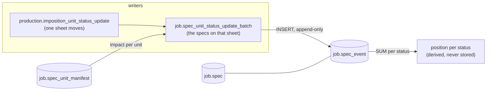

# The spec status flow

How production units move through statuses in the `job` schema: **movements,
not states.** A spec never has a status column. Every step is one append-only
row in `job.spec_event` — "12 units went from nesting to nested" — and the
current position is derived by summing those movements. Nothing is ever
updated or deleted, so any past moment can be reconstructed exactly.



## 1. the vocabulary — `job.status`

Statuses are data, not an enum in code. `sequence` is the ordering axis; the
events store the **sequence**, not the code. One table carries several
vocabularies, separated by `phase` and by number range:

| range | phase(s) | used for |
|---|---|---|
| 10 – 9990 | pre-production → shipped | the production flow below |
| 100000+ | stock-mutation, stock-location | stock movements (`log.spec_event`) |
| 200000+ | plan, archived | plan boards |

The production ladder as it stands today:

| sequence | code | phase |
|---|---|---|
| 10 | dtp_check | pre-production |
| 20 | file_in_gangrun | pre-production |
| 30 | nesting | pre-production |
| 40 | nested | batch-production |
| 50 | ripped | batch-production |
| 60 | print | batch-production |
| 70 | printed | batch-production |
| 75 | coated | batch-production |
| 80 | cutting | batch-production |
| 90 | cut | batch-production |
| 100 | finish | post-production |
| 9990 | end | shipped |

New steps slot in without code changes — `coated` was added later at 75,
between `printed` and `cutting`.

```sql
create table job.status
(
	code text not null
		primary key,
	sequence integer not null
		unique,
	phase text not null,
	created_at timestamp with time zone default now() not null,
	updated_at timestamp with time zone default now() not null
);
```

## 2. the unit carrier — `job.spec`

A spec is a produced thing on a line item: `amount` units that travel through
the flow together (until a split gives them different histories). `spec_json`
carries the specification, `parent_spec_id` links split-offs to their origin.
No status column — the position lives in the events.

```sql
create table job.spec
(
	spec_id bigint generated by default as identity
		primary key,
	line_item_id bigint not null
		references job.line_item
			on delete cascade,
	parent_spec_id bigint
		references job.spec
			on delete cascade,
	amount integer not null,
	spec_json jsonb default '{}'::jsonb not null,
	file_json jsonb default '[]'::jsonb not null,
	created_at timestamp with time zone default now() not null,
	updated_at timestamp with time zone default now() not null,
	closed_at timestamp with time zone
);
```

## 3. the route and the workload — `job.spec_unit_manifest`

Per spec the evaluated xbom: which items it consists of, which statuses each
item participates in (`possible_status_sequence`), and what one unit of that
item costs in production effort (`production_impact_per_unit`) and money
(`price`). This is what turns a movement into released workload.

```sql
create table job.spec_unit_manifest
(
	unit_manifest_id bigint generated by default as identity
		primary key,
	spec_id bigint not null
		references job.spec
			on delete cascade,
	option_code text not null,
	param_json jsonb default '{}'::jsonb not null,
	item_code text not null,
	possible_status_sequence jsonb default '[]'::jsonb not null,
	created_at timestamp with time zone default now() not null,
	updated_at timestamp with time zone default now() not null,
	config_json jsonb default '{}'::jsonb not null,
	production_impact_per_unit integer default 0 not null,
	price numeric(14,4) default 0 not null
);
```

## 4. the movements — `job.spec_event`

The heart of the flow. One row is one movement of `amount` units:

```sql
create table job.spec_event
(
	spec_event_id bigint generated always as identity
		primary key,
	spec_id bigint not null
		references job.spec,
	from_status_sequence integer,
	to_status_sequence integer,
	amount integer not null
		constraint spec_event_qty_positive
			check (amount > 0),
	remaining_impact_delta integer not null,
	resource_uids text[] default '{}'::text[] not null,
	moved_at timestamp with time zone default now() not null,
	constraint spec_event_move_valid
		check ((from_status_sequence IS NOT NULL) OR (to_status_sequence IS NOT NULL)),
	constraint spec_event_no_self
		check (from_status_sequence IS DISTINCT FROM to_status_sequence)
);
```

Reading a row:

| field | meaning |
|---|---|
| `from_status_sequence` | where the units come from; `NULL` = entry into the system |
| `to_status_sequence` | where they go; `NULL` = exit |
| `amount` | units in this movement — partial moves are normal |
| `remaining_impact_delta` | workload released: `amount × (R(to) − R(from))`, negative when moving forward |
| `resource_uids` | the machines that performed the step |
| `moved_at` | the axis for point-in-time reconstruction |

`R(s)` is the workload still ahead of status `s`: the sum of
`production_impact_per_unit` over the manifest rows whose first possible
status is at or past `s`. Moving forward makes `R(to) < R(from)`, so the
delta is negative — work got done.

## 5. who writes movements

Only one function inserts into `job.spec_event`; everything funnels through it.

```sql
create function job.spec_unit_status_update_batch(p_nest_id bigint, p_current_status_sequence integer, p_new_status_sequence integer, p_updates jsonb DEFAULT NULL::jsonb, p_resource_uids text[] DEFAULT NULL::text[]) returns void
	language plpgsql
as $$
DECLARE
    v_specs JSONB;
BEGIN
    -- Bulk mode reads per-spec amounts from the nest placement; update mode takes them explicitly.
    IF p_updates IS NULL OR jsonb_array_length(p_updates) = 0 THEN
        IF p_nest_id IS NULL THEN
            RAISE EXCEPTION 'p_updates is required when p_nest_id is NULL';
        END IF;
        SELECT placement_json -> 'specs' INTO v_specs
          FROM production.nest WHERE nest_id = p_nest_id;
    ELSE
        v_specs := p_updates;
    END IF;

    INSERT INTO job.spec_event (spec_id, from_status_sequence, to_status_sequence, amount, remaining_impact_delta, resource_uids)
    SELECT el.spec_id,
           p_current_status_sequence,
           p_new_status_sequence,
           jsonb_array_length(el.placement),
           jsonb_array_length(el.placement) * (
               COALESCE(SUM(m.production_impact_per_unit) FILTER (WHERE (m.possible_status_sequence #>> '{0,0}')::INTEGER >= p_new_status_sequence), 0)
             - COALESCE(SUM(m.production_impact_per_unit) FILTER (WHERE (m.possible_status_sequence #>> '{0,0}')::INTEGER >= p_current_status_sequence), 0)
           )::INTEGER,
           COALESCE(p_resource_uids, '{}')
      FROM jsonb_to_recordset(COALESCE(v_specs, '[]'::jsonb)) AS el(spec_id BIGINT, placement JSONB)
      LEFT JOIN job.spec_unit_manifest m ON m.spec_id = el.spec_id
     GROUP BY el.spec_id, el.placement;
END;
$$;
```

Two ways in:

- **bulk mode** — a whole sheet moves: `production.imposition_unit_status_update`
  writes one row in `production.imposition_event` (same pattern, one level up)
  and then calls this function with the `p_nest_id`; the per-spec amounts come
  from the placement on the sheet, and the same `resource_uids` flow through —
  the printer that ran the imposition ran its specs;
- **update mode** — an explicit list of `{spec_id, placement}` in `p_updates`,
  for movements that do not follow a sheet.

## 6. deriving the position

Amount per status = incoming minus outgoing. That is the whole read model:

```sql
SELECT status, SUM(amount) AS amount
FROM (
  SELECT to_status_sequence   AS status,  amount FROM job.spec_event WHERE spec_id = $1
  UNION ALL
  SELECT from_status_sequence AS status, -amount FROM job.spec_event
   WHERE spec_id = $1 AND from_status_sequence IS NOT NULL
) m
GROUP BY status
HAVING SUM(amount) <> 0;
```

The invariants that make this safe:

- **zero is absence** — a status at net zero drops out via the `HAVING`;
  zero rows are never stored or cleaned up;
- **`SUM(amount)` over all statuses is constant** and equals the unit count
  of the spec: units cannot get lost or double-counted, the ledger is
  self-checking;
- **any past moment is one predicate away**: add `AND moved_at <= $as_of`
  and the same query answers "what was true at 14:30 yesterday".

## 7. a worked example

A spec of 20 units enters, gets nested in two batches, and the first sheet
gets printed:

| # | from → to | amount | reads as |
|---|---|---|---|
| 1 | *null* → 30 nesting | 20 | entry into the system |
| 2 | 30 nesting → 40 nested | 12 | first sheet nested |
| 3 | 40 nested → 70 printed | 12 | first sheet ripped + printed |

Derived position: **8 on nesting, 12 on printed** — units of one spec sit on
several statuses at once, which is exactly what partial movements mean. The
sum is 20 at every step.

Workload: say the manifest holds print (impact 3/unit, first status 60),
cut (2/unit, first status 80) and finish (1/unit, first status 100). Then
`R(40) = 6` and `R(70) = 3` — the print work is behind the units now — so
movement #3 carries `remaining_impact_delta = 12 × (3 − 6) = −36`: that much
work left the queue. Summing the deltas gives the remaining workload at any
moment, reconstructable like everything else.

## 8. the sister tables

The same table shape exists three times; only `job` is the production truth:

| table | fed by | carries |
|---|---|---|
| `job.spec_event` | `job.spec_unit_status_update_batch` | production movements (sequences 10–9990) |
| `log.spec_event` | `log.crud_spec_event` (sync) | stock mutations (sequences 100000+) |
| `mock.spec_event` | mock generators | test data for the planning screens |

Why append-only at all: the old counter model updated an amount per status in
place — at ~200,000 units/day across ~10 statuses that is ~2 million updates
on a small hot row set, the worst case for MVCC bloat. Appends have no dead
tuples, and the full history comes for free. The complete reasoning lives in
`docs/domain-model.md`, sections 7 and 8.
